<!-- ═══════════════════════════════════════════════════════════════ -->
<!--                  MANJEET SINGH — GitHub Profile               -->
<!-- ═══════════════════════════════════════════════════════════════ -->

<div align="center">

<!-- Animated header banner -->


</div>

---

<div align="center">

```
┌─────────────────────────────────────────────────────────────────┐
│                                                                  │
│    func main() {                                                 │
│        me := Engineer{                                           │
│            Name:     "Manjeet Singh",                            │
│            Location: "Melbourne, VIC 🇦🇺",                       │
│            XP:       "8 years",                                  │
│            Mission:  "Build systems that think",                 │
│        }                                                         │
│        me.Build(DistributedSystems, LLMAgents, OpenSource)       │
│    }                                                             │
│                                                                  │
└─────────────────────────────────────────────────────────────────┘
```

</div>

---

## 🧬 Origin Story

> *"I didn't just write code. I designed conversations between machines."*

Started as a backend engineer building chatbots with IBM Watson. Moved to designing real-time architectures for **millions of concurrent players** in Ludo King™ & Carrom King™. Then fleet systems, distributed microservices, and serverless AWS at scale.

Today? I'm at the intersection of **distributed systems** and **LLM-powered intelligence** — engineering agents that reason, parse, and understand code itself.

The through-line across 8 years: **systems that don't just process data, but make sense of it**.

---

## ⚡ The Stack

<div align="center">

### 🐹 Go — My Primary Weapon
*Concurrency. Performance. Simplicity.*


*Worker pools · errgroup · singleflight · channels · atomic ops*

---

### 🟦 TypeScript / Node.js — The Ecosystem
*When speed-to-ship matters.*


---

### 🤖 LLMs & AI — The New Frontier
*I don't just use AI. I build infrastructure for it.*


*Claude Code · GPT-4 · Llama · Agent Orchestration · AST → Knowledge Graphs*

---

### ☁️ Cloud & Data
*Where the rubber meets the road.*


</div>

---

## 🔭 What I'm Building Now

```go
type CurrentFocus struct {
    Project   string   // "Go Code Analysis Engine"
    Stack     []string // ["Go", "Neo4j", "AST Parsing", "Claude API"]
    Stage     string   // "Stage 2: AST → Knowledge Graph ingestion"
    Goal      string   // "Give LLMs deep codebase understanding"
    Learning  []string // ["Claude Certified Architect", "Agentic Patterns"]
}
```

- 🧠 **Go Code Analysis Engine** — Ingests entire repos, parses Go ASTs, stores relationships in a **Neo4j knowledge graph** to give LLMs real context about codebases
- 🎓 **Claude Certified Architect** — Studying agentic architecture, orchestration patterns, multi-agent systems
- ⚙️ **AI Agent Infrastructure** — Exploring how to build reliable, observable agent systems in Go

---

## 🏗️ Highlight Projects

<table>
<tr>
<td width="50%">

### 🚗 VGO™ Fleet Platform
**Dimiour · 2021–2024**

Fleet management system built from scratch. Real-time vehicle tracking, matchmaking engine pairing users with optimal vehicles, fuel analytics.

`Go` `GraphQL` `AWS Lambda` `DynamoDB` `EKS` `EventBridge`

> Reduced infrastructure costs **20%**, latency **60s → near real-time**

</td>
<td width="50%">

### 🧬 Code Analysis Engine *(POC)*
**GlobalLogic · 2025**

Repo ingestion pipeline → Tree-sitter AST parsing → Amazon Neptune knowledge graph → LLM context layer. Enables AI to *understand* code, not just read it.

`Go` `Next.js` `Amazon Neptune` `AWS Glue` `Step Functions`

> Proof that LLMs + structured graphs = genuine code intelligence

</td>
</tr>
<tr>
<td width="50%">

### 🎮 Ludo King™ & Carrom King™
**Gametion · 2019–2021**

Tournament engine for **millions of concurrent players**. Bracket generation, real-time state sync, concurrency-safe Redis operations via Lua scripting.

`Node.js` `Go` `Redis Pub-Sub` `MongoDB` `Lua` `AWS EC2`

> Reduced game exploitation attempts by **80%**

</td>
<td width="50%">

### 🏥 REACHhealth Platform
**smartData · 2017–2019**

Cloud-native backend for ingesting wearable + clinical data. High-throughput pipelines with Fitbit, Apple Watch SDK integrations.

`Node.js` `IBM Watson` `AWS` `Data Pipelines`

> First foray into "systems that understand humans"

</td>
</tr>
</table>

---

## `$ htop` — GitHub Activity

<div align="center">


&nbsp;&nbsp;


</div>

<div align="center">


</div>

---

## 🧠 Engineering Philosophy

<div align="center">

| Principle | How I Apply It |
|-----------|---------------|
| 🔩 **Concurrency is a design problem** | Think in goroutines, channels, and backpressure from day one |
| 📊 **Observability is not optional** | AWS X-Ray, structured logs, distributed tracing baked in |
| 🤖 **AI amplifies, not replaces** | Use Claude Code to think faster, but own every architecture decision |
| 🌊 **Events over polling** | EventBridge, SNS, CQRS — systems should react, not ask |
| 🗺️ **Graphs reveal what tables hide** | Knowledge graphs for relationships, not just foreign keys |

</div>

---

## 🌐 Connect

<div align="center">

[](https://www.linkedin.com/in/manjeet-thakur/)
[](mailto:manjeetthakur@outlook.com)
[](https://www.google.com/maps/place/Melbourne)

</div>

---

<div align="center">


*"The best systems are the ones that make complexity invisible."*


</div>
